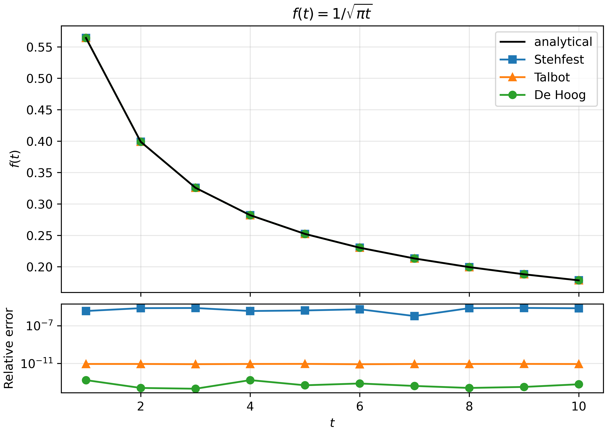
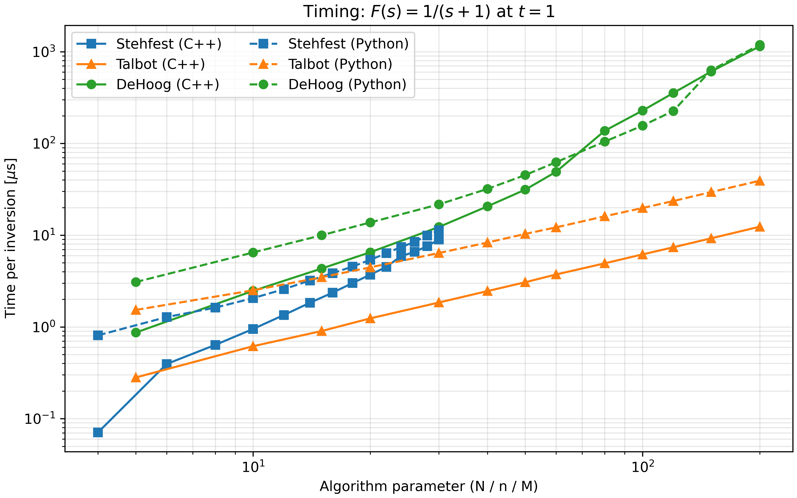
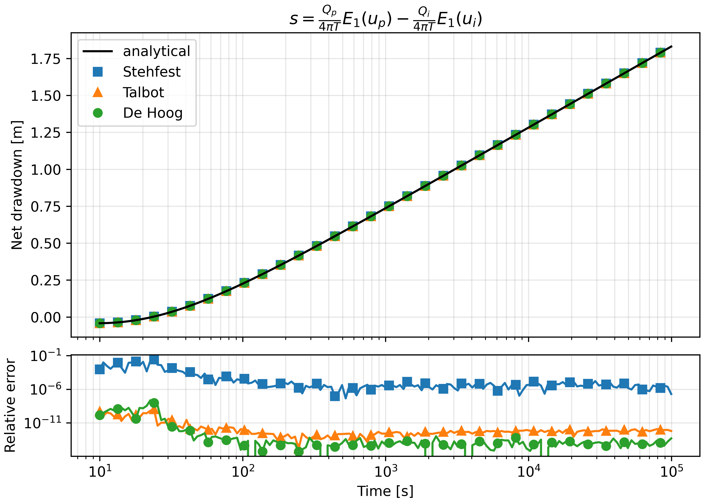
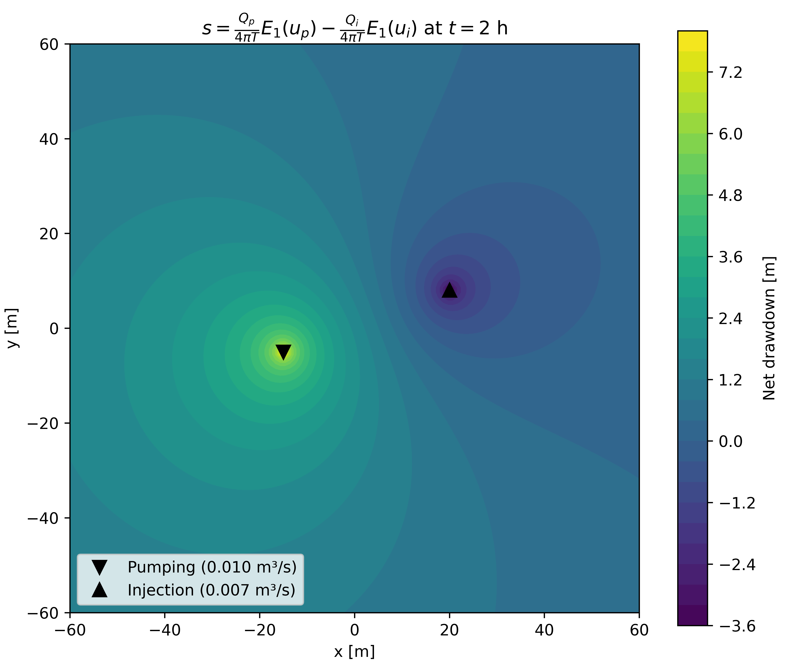

# Summary

NILT is a C++ header-only library (with Python bindings) that numerically inverts Laplace transforms using three algorithms: the Gaver-Stehfest method [@stehfest1970], the fixed Talbot contour [@abate2006], and the accelerated Fourier series of De Hoog et al. [@dehoog1982]. Users pass any callable $F(s)$ and a time $t$, the library returns $f(t) = \mathcal{L}^{-1}\{F\}(t)$.

All three algorithms share the same two-argument interface in both C++ and Python:

**Python**

```python
algo(F, t)
```

**C++**

```cpp
nilt::invert(algo, F, t)
```

The Stehfest algorithm requires that $F(s)$ be real-valued while Talbot and De Hoog operate on complex-valued transforms. Each algorithm exposes tunable parameters (number of terms, tolerance, contour shift) with defaults that work well for most problems.

The Python bindings are built with pybind11 and accept both scalars and NumPy array arguments. If using Python and evlauating over a list of scalars, it is more efficient to use NumPy arrays as arguments. The library was originally developed for continuous time random walk simulations of reactive transport in porous media [@@oliveira2020,oliveira2021,@oliveira2023].

# Statement of need

Many problems in physics and engineering are easier to solve in the Laplace domain than in the time domain. Groundwater drawdown, heat conduction in semi-infinite solids, diffusion from spheres and cylinders, viscoelastic creep are great examples that have closed-form Laplace-domain solutions that are difficult or impossible to invert analytically.

Existing tools are scattered:

- MATLAB's `ilaplace` implements a inverse Laplace transform but it has no access to individual methods or parameters within it, and do not offer open-source license. 
- Python's `mpmath.invertlaplace` provides all three families of methods (and Cohen method as well) but is written in pure Python with arbitrary-precision arithmetic, but a Python-first implementaiton is far slower when you need to invert at thousands of points.
- The [`ilt`](https://github.com/nocliper/ilt) package wraps a single algorithm and it provides an implementation that is too tightly integrated to the applicatoin (transient spectroscopy). 
- No other C++ library packages multiple algorithms behind a common interface.

NILT provides Stehfest, Talbot, and De Hoog in a dependency-free C++ header that compiles with any C++14 toolchain. The Python bindings expose the same compiled code for scripting and prototyping. 

# State of the field

NILT implements three families of numerical Laplace inversion.

The Stehfest algorithm [@stehfest1970] approximates $f(t)$ using a weighted sum of $F(s)$ evaluated at real points on the positive real axis. It is fast and simple but restricted to real-valued transforms. The accuracy of the method degrades for oscillatory or discontinuous $f(t)$.

The fixed Talbot contour, in the formulation of Abate and Whitt [@abate2006], deforms the Bromwich integral into the complex plane. It converges rapidly for oscillatory functions but requires $F(s)$ to accept complex arguments.

De Hoog et al. [@dehoog1982] accelerate the Fourier series representation of the inverse transform using a quotient-difference algorithm. Like Talbot, it works with complex $F(s)$ and can handle discontinuities.

These methods differ in which transforms they accept and how they trade speed for accuracy. Packaging them behind one interface makes it easy to cross-check results or swap algorithms when one performs poorly on a given problem.

# Software design

NILT is a header-only C++ library. Including `<nilt.hpp>` pulls in `stehfest.hpp`, `talbot.hpp`, and `dehoog.hpp`. There are no linking step or external dependencies. Each algorithm is a struct with tunable parameters and an `operator()` that accepts any callable $F(s)$ and a time $t$.

A *free* function `nilt::invert(algo, F, t)` provides a uniform entry point. The entire library is templated so there is no virtual dispatch and no heap allocation.

The Python layer is built with pybind11 and packaged via scikit-build-core. `Stehfest`, `Talbot`, and `DeHoog` mirror their C++ counterparts. The `invert` function accepts NumPy arrays, so evaluating $f(t)$ at a vector of time points is a single call. The Python binding tries to be as shallow as possible, with the NumPy arrays arguments being the main difference between each package. 

The repository contains 10 verification functions drawn from Stehfest [@stehfest1970] and Abate and Whitt [@abate2006], plus five worked physics examples from groundwater and transport phenomena: 

- Theis well drawdown
- pumping-injection dipole
- sphere and cylinder diffusion
- 2-D advection-diffusion plume 

Each example exists as both a C++ executable and a Python script that compare all three algorithms against the known analytical solution.

## Verification

The verification suite evaluates all three methods against 10 known Laplace transform pairs. \autoref{tab:benchmark} shows one of these functions, $f(t) = 1/\sqrt{\pi t}$, from Stehfest [-@stehfest1970]. \autoref{fig:verification} plots the inversions alongside the error. All three methods recover the analytical solution, but their error characteristics differ: Stehfest errors are around $10^{-6}$, while Talbot and De Hoog reach $10^{-12}$ or better.

: Benchmark results for $f(t) = 1/\sqrt{\pi t}$, $F(s) = 1/\sqrt{s}$ \label{tab:benchmark}

| t  | f(t)      | Stehfest  | err      | Talbot    | err      | De Hoog   | err      |
|----|-----------|-----------|----------|-----------|----------|-----------|----------|
| 1  | 5.642e-01 | 5.642e-01 | 2.17e-06 | 5.642e-01 | 4.63e-12 | 5.642e-01 | 1.73e-13 |
| 2  | 3.989e-01 | 3.989e-01 | 4.92e-06 | 3.989e-01 | 4.82e-12 | 3.989e-01 | 2.70e-14 |
| 5  | 2.523e-01 | 2.523e-01 | 4.24e-06 | 2.523e-01 | 4.87e-12 | 2.523e-01 | 5.06e-14 |
| 10 | 1.784e-01 | 1.784e-01 | 5.70e-06 | 1.784e-01 | 4.84e-12 | 1.784e-01 | 6.02e-14 |



\autoref{fig:timing} shows timing per inversion call as a function of the algorithm parameter (N, n, or M) for $F(s) = 1/(s+1)$ at $t = 1$. Solid lines are C++, dashed lines are Python. The Python bindings add minimal overhead since the inversion itself runs in compiled C++. Stehfest is the cheapest at low parameter counts, De Hoog becomes the most expensive at high orders. Talbot sits in between.



## Selected example: groundwater well dipole

The well dipole example (\autoref{fig:dipole_time}, \autoref{fig:dipole_spatial}) shows NILT applied to a 2-D groundwater problem with no radial symmetry. A pumping well ($Q_p = 0.010$ m$^3$/s) and an injection well ($Q_i = 0.007$ m$^3$/s) are placed at different locations in a confined aquifer ($T = 10^{-3}$ m$^2$/s, $S = 10^{-4}$). The Laplace-domain solution is a superposition of $K_0$ Bessel functions, inverted pointwise at each $(x, y)$ grid node.

\autoref{fig:dipole_time} compares the numerical inversions against the analytical $E_1$ solution over time at a fixed observation point. All three methods track the analytical curve, Stehfest shows larger relative error at early times (around $10^{-1}$) while Talbot and De Hoog stay below $10^{-10}$.

\autoref{fig:dipole_spatial} shows the net drawdown field at $t = 2$ h. The pumping well (bottom-left) draws water down, the injection well (top-right) pushes it up, and the asymmetric contours reflect their different rates. This is the kind of spatial field that requires thousands of pointwise inversions, when a compiled backend matters.





# Research impact

NILT was developed during a PhD on reactive transport modelling using continuous time random walks [@oliveira2021] and the derived works [@oliveira2020,@oliveira2023], where the Laplace inversion routines were used to compute first-passage time distributions and breakthrough curves in heterogeneous porous media. The library has since been extracted and released as standalone software.

# AI usage disclosure

AI tools were used for code refactoring, and documentation editing. All scientific content, algorithm implementations, and mathematical formulations are the author's own work.

# References
